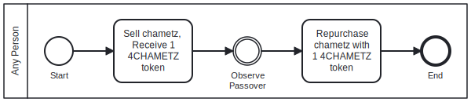

# DeChametzMe 🍞 🔂 💸 🤝

DeChametzMe is an example application created using the AlgoKit full-stack project template that includes a smart contract & deploy scripts in Python and a React+Vite front end in TypeScript.

## Decentralized Sale and Repurchase of Chametz

DeChametzMe is a way to sell your chametz without another person by selling it to a smart contract on a public blockchain, Algorand MainNet.

### Chametz and Passover

Chametz is the Hebrew term for leavened foods that are prohibited during the Jewish holiday of Passover. One way to comply with the requirement to remove chametz to observe Passover is a practice _Mechirah_ of selling one's chametz to a non-Jewish person for the duration of Passover and repurchasing it after the holiday.

This is more than just a symbolic gesture; it is a legally binding sale. To help facilitate this, some Jewish communities sign a contract with a rabbi as agent to avoid everyone needing to find a non-Jewish buyer for their chametz.

Could there be an easier, decentralized way to sell one's chametz to a non-Jew? Enter blockchain technology!

### Decentralized Mechirah

DeChametzMe enables Jewish people to sell their chametz to a smart contract application on the Algorand blockchain rather than needing to find a human buyer or retain a Rabbi as their agent. Instead, the smart contract serves as a willing buyer for anyone to transact with permissionlessly at any time.

The web app enables users to connect an Algorand wallet, describe the chametz they want to sell, and transfer it to the smart contract in exchange for one unit of a token "4CHAMETZ" that represents a transfer of value similar to the tradition of selling chametz for one dollar.

Once sold, the chametz belongs to the smart contract, which is defined as being non-Jewish to satisfy that requirement. This fact can be seen in the global state of the application on chain. After Passover, the token can be used to repurchase the chametz from the smart contract.

With the capabilities of blockchain, anyone can "de-chametz" themselves to prepare for Passover!

### Process Diagram

The process of interacting with the smart contract is extremely simple as anyone can call the smart contract to sell chametz and then later repurchase it.

Note: The contract does not enforce any timing related to Passover as the exact timing of the holiday differs around the world while the smart contract exists in one state for the entire Algorand blockchain network globally.

### Deployment

The DeChametzMe smart contract is deployed to TestNet as application [733981798](https://lora.algokit.io/testnet/application/733981798/).

## Project Setup

### Initial Setup

1. Clone this repository to your local machine.
2. Ensure [Docker](https://www.docker.com/) is installed and operational. Then, install `AlgoKit` following this [guide](https://github.com/algorandfoundation/algokit-cli#install).
3. Run `algokit project bootstrap all` in the project directory. This command sets up your environment by installing necessary dependencies, setting up a Python virtual environment, and preparing your `.env` file.
4. In the case of a smart contract project, execute `algokit generate env-file -a target_network localnet` from the `DeChametzMe-contracts` directory to create a `.env.localnet` file with default configuration for `localnet`.
5. To build your project, execute `algokit project run build`. This compiles your project and prepares it for running.
6. For project-specific instructions, refer to the READMEs of the child projects:
   - Smart Contracts: [DeChametzMe-contracts](projects/DeChametzMe-contracts/README.md)
   - Frontend Application: [DeChametzMe-frontend](projects/DeChametzMe-frontend/README.md)

> This project is structured as a monorepo, refer to the [documentation](https://github.com/algorandfoundation/algokit-cli/blob/main/docs/features/project/run.md) to learn more about custom command orchestration via `algokit project run`.

### Subsequently

1. If you update to the latest source code and there are new dependencies, you will need to run `algokit project bootstrap all` again.
2. Follow step 3 above.

### Continuous Integration / Continuous Deployment (CI/CD)

This project uses [GitHub Actions](https://docs.github.com/en/actions/learn-github-actions/understanding-github-actions) to define CI/CD workflows, which are located in the [`.github/workflows`](./.github/workflows) folder. You can configure these actions to suit your project's needs, including CI checks, audits, linting, type checking, testing, and deployments to TestNet.

For pushes to `main` branch, after the above checks pass, the following deployment actions are performed:

- The smart contract(s) are deployed to TestNet using [AlgoNode](https://algonode.io).
- The frontend application is deployed to a provider of your choice (Netlify, Vercel, etc.). See [frontend README](frontend/README.md) for more information.

> Please note deployment of smart contracts is done via `algokit deploy` command which can be invoked both via CI as seen on this project, or locally. For more information on how to use `algokit deploy` please see [AlgoKit documentation](https://github.com/algorandfoundation/algokit-cli/blob/main/docs/features/deploy.md).

## Tools

This project makes use of Python and React to build Algorand smart contracts and to provide a base project configuration to develop frontends for your Algorand dApps and interactions with smart contracts. The following tools are in use:

- Algorand, AlgoKit, and AlgoKit Utils
- Python dependencies including Poetry, Black, Ruff or Flake8, mypy, pytest, and pip-audit
- React and related dependencies including AlgoKit Utils, Tailwind CSS, daisyUI, use-wallet, npm, jest, playwright, Prettier, ESLint, and Github Actions workflows for build validation

### VSCode

It has also been configured to have a productive dev experience out of the box in [VS Code](https://code.visualstudio.com/), see the [backend .vscode](./backend/.vscode) and [frontend .vscode](./frontend/.vscode) folders for more details.

## Integrating with Smart Contracts and Application Clients

Refer to the [DeChametzMe-contracts](projects/DeChametzMe-contracts/README.md) folder for overview of working with smart contracts, [projects/DeChametzMe-frontend](projects/DeChametzMe-frontend/README.md) for overview of the React project and the [projects/DeChametzMe-frontend/contracts](projects/DeChametzMe-frontend/src/contracts/README.md) folder for README on adding new smart contracts from backend as application clients on your frontend. The templates provided in these folders will help you get started.
When you compile and generate smart contract artifacts, your frontend component will automatically generate typescript application clients from smart contract artifacts and move them to `frontend/src/contracts` folder, see [`generate:app-clients` in package.json](projects/DeChametzMe-frontend/package.json). Afterwards, you are free to import and use them in your frontend application.

The frontend starter also provides an example of interactions with your DeChametzClient in [`AppCalls.tsx`](projects/DeChametzMe-frontend/src/components/AppCalls.tsx) component by default.

## Next Steps

You can take this project and customize it to build your own decentralized applications on Algorand. Make sure to understand how to use AlgoKit and how to write smart contracts for Algorand before you start.
